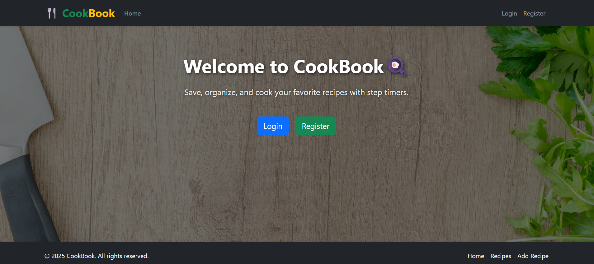

# 🍴 CookBook - Frontend

This is the **frontend** for the CookBook application, built with **React**, **React Router**, and **Bootstrap 5**. Users can browse, add, edit, and cook recipes with step timers.

 ### Preview



## 🌐 Live Demo

[Frontend deployed on Vercel](https://cookbook-frontend-oi5f.vercel.app)

##  Features

- User authentication (Login/Register)
- View, add, and edit recipes
- Step-based cooking timers
- Responsive design with Bootstrap
- Dark-themed interface
- Persistent login with localStorage

## 🛠️ Tech Stack

- React.js (v18+)
- React Router v6
- Bootstrap 5
- CSS
- Vite (frontend bundler)

## 💻 Installation

1. Clone the repository:

```bash
git clone https://github.com/yourusername/cookbook-frontend.git
cd cookbook-frontend
Install dependencies:

bash
npm install
Create a .env file in the root with:

env
VITE_API_BASE_URL=https://your-backend-url.com
Run the app locally:

bash
npm run dev
Open your browser at http://localhost:5173.
```
```
##📂 Folder Structure
src/
 ├─ components/    # Navbar, Footer, reusable UI components
 ├─ pages/         # Home, Login, Register, Recipe pages
 ├─ assets/        # Images, background
 ├─ App.jsx
 └─ main.jsx
```
🔧 Scripts
npm run dev — run the app in development mode

npm run build — build for production

npm run preview — preview the production build